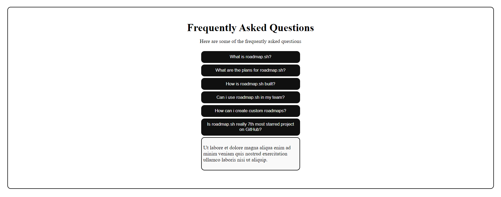

Accordion Component

Web link - https://abh7n.github.io/accordion/

A responsive and accessible accordion component built with HTML, CSS, and JavaScript.

Features

- 6 sections with toggleable content
- Responsive design for various screen sizes
- Accessible for screen readers and keyboard navigation
- Easy to customize and integrate into existing projects

Installation

1. Clone the repository: `git clone (link unavailable)
2. Open index.html in your browser

Usage

1. Click on an accordion section title to expand/collapse its content
2. Use keyboard navigation to toggle sections (arrow keys and space/enter)

Customization

- Modify style.css for visual styling
- Adjust script.js for custom functionality
- Update index.html for content changes

Browser Support

- Google Chrome
- Mozilla Firefox
- Microsoft Edge
- Safari

License

MIT License

Contributing

Pull requests and issues welcome!

Author

(link unavailable)

Version

1.0.0

